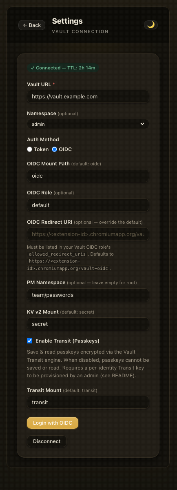
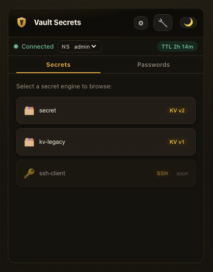
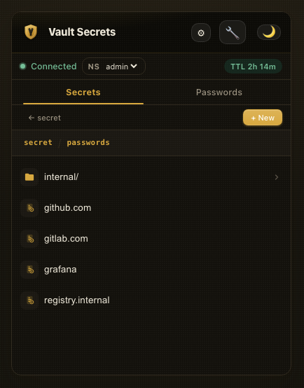
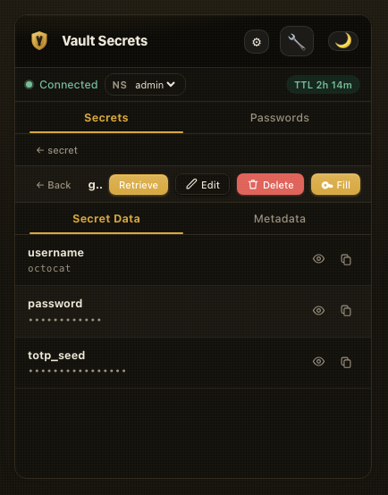
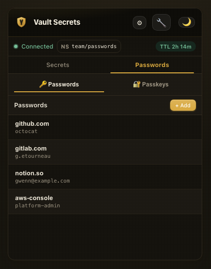
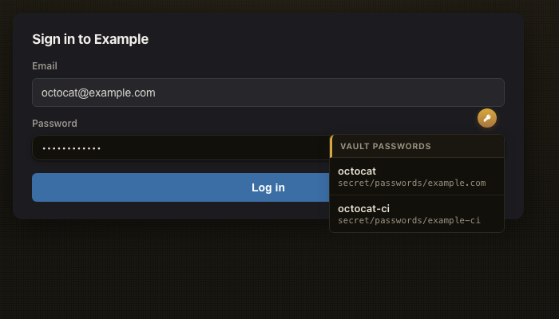
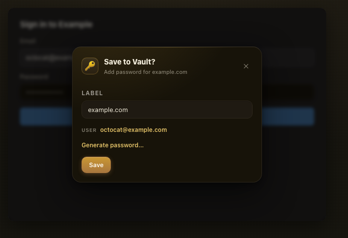

# Vault Chrome Extension

A password manager Chrome extension that connects to HashiCorp Vault. Browse, create, edit, and
delete KV secrets directly from your browser, with auto-fill and auto-save for login forms.

---

## Screenshots

| Options page (PM settings) | Mount picker |
|---|---|
|  |  |

| Secret browser | Secret detail |
|---|---|
|  |  |

| Password Manager | Auto-fill overlay |
|---|---|
|  |  |

| Auto-save banner |
|---|
|  |

---

## Prerequisites

| Requirement | Version |
|---|---|
| Node.js | 18 or later |
| npm | 9 or later |
| Google Chrome | 88 or later (Manifest V3 support) |
| HashiCorp Vault | 1.9 or later |
| Vault KV secret engine | v1 or v2 mounted (v2 required for auto-fill/auto-save) |

For OIDC authentication, your Vault instance must have the OIDC auth method enabled and configured.

---

## Build & Install

```bash
# 1. Install dependencies
cd vault-chrome-extension
npm install

# 2. Build the extension
npm run build

# 3. Load in Chrome
#    → Open chrome://extensions
#    → Enable "Developer mode" (top-right toggle)
#    → Click "Load unpacked"
#    → Select the dist/ folder produced by the build
```

For development with automatic rebuilds on file changes:

```bash
npm run dev
```

---

## Configuration

Open the extension options page by:
- Clicking the extension icon → **⚙ Settings**, or
- Navigating to `chrome://extensions` → Vault Extension → "Extension options"

### Vault URL

Enter the full HTTPS URL of your Vault instance, e.g. `https://vault.example.com`.
HTTP URLs are not accepted.

### Namespace _(optional)_

For Vault Enterprise, enter your namespace path, e.g. `admin` or `my-org/my-team`.
Leave blank for open-source Vault.

This namespace becomes the **root namespace** for your session — all secret browsing, mount
listing, and child-namespace discovery are scoped to it. For example, if you log in with
namespace `admin`:

- The NS picker lists child namespaces as absolute paths: `admin/team-a`, `admin/team-b`.
- Switching into a child namespace sets the active namespace to its absolute path.
- The **↑** button in the status bar moves one level up to the parent namespace.
- On the **Passwords** page the NS area shows the Password Manager's dedicated namespace
  (`pmNamespace`, or `(root)` when unset) as read-only text rather than an editable dropdown.

### Authentication Method

#### Token

1. Select **Token** as the auth method.
2. Paste your Vault token into the token field.
3. Click **Verify & Save** — the extension validates the token against Vault before saving.

To generate a token:

```bash
vault token create -policy=default -ttl=24h
```

#### OIDC

1. Select **OIDC** as the auth method.
2. Enter the OIDC **role name** configured in your Vault OIDC auth mount.
3. _(Optional)_ Set the **OIDC mount path** if it is not the default `oidc`.
4. Click **Login with OIDC** — Chrome opens the OAuth flow with your identity provider and,
   on success, saves the Vault token automatically.

> **Redirect URI:** the extension authenticates via `chrome.identity.launchWebAuthFlow`, which
> requires a redirect URI under the extension's own `https://<extension-id>.chromiumapp.org/`
> origin (default path `/vault-oidc`). Add this URL to your Vault OIDC role's
> `allowed_redirect_uris`, e.g.
> `vault write auth/oidc/role/default allowed_redirect_uris="https://<extension-id>.chromiumapp.org/vault-oidc"`.
> If your role requires a different redirect URI, set the **Redirect URI** override in Settings
> to your configured `https://…chromiumapp.org/…` path.
>
> **Stable extension ID:** this manifest pins a fixed `key`, so every installation derives the
> **same** extension ID (and therefore the same redirect URI) — including "Load unpacked" /
> unpacked distribution. You only need to whitelist one redirect URI. Keep the matching private
> key (`.keys/extension_private_key.pem`, gitignored) safe: it must never be lost or committed,
> and any change to the key changes the extension ID and breaks the OIDC redirect.

### Disconnect

Click **Disconnect** to revoke the current Vault token and clear all stored credentials.

---

## Password Manager

The Password Manager is a private, per-user credential vault kept separate from the shared
Secret Browser. Each user's credentials are stored under their own subtree, keyed by their
Vault entity ID, so a token can only ever see its own passwords.

### PM Settings

The PM is configured in the **Password Manager** fields of the options page (they are set up
when you first connect). All fields are optional:

| Setting | Meaning | Default |
|---|---|---|
| **PM Namespace** | A dedicated Vault namespace for Password Manager storage. Leave empty to use the root namespace. | *(root namespace)* |
| **KV v2 Mount** | The KV v2 secret mount inside that namespace where credentials are stored. | `secret` |
| **Enable Transit (Passkeys)** | Enables saving & reading passkeys, encrypted at rest via the Vault **Transit** engine. When **disabled, passkeys cannot be saved or read** from the extension. | off |
| **Transit Mount** | The Transit mount inside that namespace used to encrypt passkeys. A per-identity key must be provisioned by an admin (see below). | `transit` |

> The PM is **KV v2 only** — the configured mount must be a KV version 2 secret engine.

### How credentials are stored

Inside the PM mount, each sign-in is stored at a path scoped to the logged-in identity:

```
{pmMount}/password-manager/{entity_id}/{label}
```

Where:

- `{pmMount}` is the configured KV v2 mount (default `secret`).
- `{entity_id}` is the Vault identity entity ID of the logged-in user — this is what keeps
  every user's credentials isolated from one another.
- `{label}` is a human-readable name for the credential (e.g. `github.com`).

The extension reads the entity ID from the token's `entity_id` field at login and uses it for
both storing and searching credentials.

### Example policy

Because the credential path contains the entity ID, a Vault ACL policy must **not** hard-code
a fixed path. Instead it uses the `{{identity.entity.id}}` template, which Vault resolves at
request time to the calling token's entity — granting each user access to only their own
subtree. If you hard-coded a literal path, every user would either share one folder or be
locked out.

```hcl
# Each user may manage only their own Password Manager subtree.
# {{identity.entity.id}} is resolved per-request to the entity ID of the caller, so
# credentials stay isolated per user.

# Read/write the secret data (username, password).
path "secret/data/password-manager/{{identity.entity.id}}/*" {
  capabilities = ["create", "read", "update", "patch", "delete"]
}

# List credentials, and read/update the url custom-metadata used for auto-fill matching.
path "secret/metadata/password-manager/{{identity.entity.id}}/*" {
  capabilities = ["list", "read", "create", "update"]
}

# Optional: allow the "Generate Password" tool to list and use password policies.
path "sys/policies/password/*" {
  capabilities = ["read", "list"]
}
```

> Notes on matching:
> - `secret` is the **KV v2 mount** from the PM settings — adjust it if you mounted the engine
>   elsewhere (e.g. `vault kv enable -path=kv-v2 kv-v2` → use `kv-v2`).
> - Listing always operates on a **prefix**, so Vault matches `list` against the `/*` glob form
>   above rather than a bare folder path — there is no separate rule for the directory itself.
> - The data/metadata paths are **relative to the namespace the policy is assigned in**. If you
>   set a **PM Namespace** such as `team/passwords`, create/attach this policy *inside that
>   namespace* (the relative `secret/...` paths resolve there) — do **not** prefix the paths
>   with the namespace name.

### Passkeys (Transit)

Passkeys are optional. They are only available when **Enable Transit (Passkeys)** is turned on
in the PM settings — when it is off, the extension cannot save or read passkeys.

Each passkey is stored in the same per-identity PM subtree as passwords:

```
{pmMount}/password-manager/{entity_id}/passkeys/{label}
```

Only the **secret** (e.g. a private key or credential blob) is encrypted; it is encrypted with
the Vault **Transit** engine before being written to KV, and decrypted again when you reveal it.
The rest of the record (`rpId`, `username`, `keyVersion`) is stored as plaintext metadata, the
same way passwords store their `url` custom-metadata.

#### One Transit key per identity

The extension encrypts with a **single Transit key per identity**, named after the entity ID:

```
transit/passkey-{entity_id}
```

Naming the key after the identity keeps the ACL policy small: a policy that uses the
`{{identity.entity.id}}` template grants each user access to *their own* key and no one else's,
with no per-user list to maintain.

#### WebAuthn software authenticator

Beyond storing them, the extension acts as a **WebAuthn software authenticator**. A MAIN-world
content script intercepts `navigator.credentials.create()` / `navigator.credentials.get()` at
`document_start` and, when this feature is enabled, answers from a passkey stored in Vault. A
site using the standard WebAuthn APIs therefore sees the extension as another passkey provider:

- **Create (registration):** when a site asks to register a passkey, the extension generates an
  ES256 (P-256, COSE `-7`) key pair, builds a self-attested attestation object (`fmt: "none"`),
  saves the credential (private JWK encrypted via Transit) under `passkeys/{rpId}`, and returns
  the new `PublicKeyCredential`.
- **Get (authentication):** when a site asks to sign in with a passkey for an `rpId` you have
  saved, the extension decrypts the private key, signs a valid ECDSA assertion over
  `authenticatorData || clientDataHash`, and returns it.

If the extension cannot service a request (Transit disabled, no matching passkey, or no
extension running), it transparently falls back to the browser's native flow — so security keys
and other passkey providers keep working.

Notes & constraints:

- Only **ES256** (P-256 / COSE `-7`) is supported; a request that *only* offers other algorithms
  is left to the native flow.
- One credential is stored per relying party (label = `rpId`) for now.
- The private key is the only thing encrypted; identifiers (`rpId`, `credentialId`, `userHandle`,
  `userName`, algorithm, counter) are plaintext KV metadata.
- The returned credential is a synthetic `PublicKeyCredential`: relying-party libraries that call
  `getClientExtensionResults()`/`getTransports()` are supported, but a site doing a strict
  `instanceof PublicKeyCredential` check will not recognize it.


#### Admin provisioning

The Transit key must be **created by an admin** — the extension never creates it. The admin
needs each user's entity ID, which the extension displays/stores after login (`vaultEntityId`),
or can be found with:

```console
$ vault token lookup -format=json | jq -r .data.entity_id
```

Then enable the Transit engine (once) and create one key per user:

```console
$ vault secrets enable -path=transit transit
$ vault write -f transit/keys/passkey-<entity_id>
```

> Use the actual entity ID in place of `<entity_id>` (e.g. `passkey-8f4a2c1b-...`). If you set a
> **PM Namespace**, enable Transit and create the keys *inside that namespace*.

#### Example policy

Add these rules to the PM policy so each user may encrypt/decrypt only their own passkey key:

```hcl
# Encrypt passkeys with the caller's own Transit key.
path "transit/encrypt/passkey-{{identity.entity.id}}" {
  capabilities = ["create", "update"]
}

# Decrypt passkeys with the caller's own Transit key.
path "transit/decrypt/passkey-{{identity.entity.id}}" {
  capabilities = ["create", "update"]
}
```

> As with the KV paths above, the `transit/...` paths are relative to the namespace the policy
> is assigned in. If you used a different Transit mount path, adjust it here (e.g. `mytransit/...`).

---

## Secret Browser

Click the extension icon to open the popup.

### Namespace Picker

The status bar contains an **NS** dropdown showing the current namespace.

- While connected, the dropdown lists all child namespaces of the root namespace (the one set
  at login time). Selecting a child switches the active namespace to its absolute path
  (e.g. `admin/team-a`).
- When inside a child namespace, a **↩ \<root\>** button appears to return to the login-time
  root.
- The root option in the dropdown always represents the login-time namespace, not the global
  Vault root.

> Namespace switching requires Vault Enterprise with namespaces enabled. On open-source Vault
> the dropdown will be empty and the NS picker is a no-op.

### Selecting a Mount

After logging in the popup shows the **mount picker** — a list of all secret engine mounts
visible from the current namespace:

- 🗂 **KV** mounts (v1 or v2) — click to start browsing secrets.
- 🔑 **SSH** mounts — listed but not yet interactive _(coming soon)_.

The KV version (v1 or v2) is auto-detected from the mount configuration.

### Navigating Secrets

- **Folders** (keys ending in `/`) are shown with a folder icon — click to navigate into them.
- **Secrets** are shown with a document icon — click to view their contents.
- Use the **breadcrumb trail** at the top to navigate back up the path.

### Viewing a Secret

Click a secret to open the detail view:

- Click **Retrieve** to load the secret data from Vault.
- Values are **masked by default** — click the eye icon to reveal.
- Click the **copy** icon next to any value to copy it to your clipboard.
- The **Edit** button opens the secret in edit mode.
- The **Delete** button shows a confirmation prompt before permanently deleting the secret.

For **KV v2 secrets**, a **Metadata** tab shows and lets you edit the `custom_metadata` fields,
including the `url` field used for auto-fill matching.

### Creating a Secret

Click **+ New Secret** while browsing a mount. Enter the secret name (path), then add key-value
pairs using the inline editor. For KV v2 secrets you will also be prompted to add a `url` metadata
field (used for auto-fill).

---

## Auto-fill

Auto-fill requires a **KV v2** mount and a `url` field stored in the secret's **custom metadata**.

### How it works

1. When a page with a password field is loaded, the extension injects a small **Vault** button
   next to the password input.
2. Clicking the button searches all KV v2 mounts for secrets whose `url` metadata field matches
   the current page's hostname (exact match or subdomain match).
3. Matching secrets are shown in a dropdown.
4. Selecting a credential fills the username and password fields automatically, dispatching native
   `input` and `change` events so React/Vue/Angular forms update their state.

### Setting up a secret for auto-fill

1. Create a KV v2 secret with `username` and `password` as the data keys.
2. Open the secret's **Metadata** tab and set `url` to the site's URL, e.g. `https://github.com`.
3. The extension matches on the hostname (`github.com`) — subdomains like `gist.github.com`
   will also match.

---

## Auto-save

After submitting a login form that has no matching Vault secret, a **Save to Vault?** popup appears —
centered over the page with a dimmed backdrop (not a top-of-page banner).

### How it works

1. The extension detects password field `submit` events and captures the credentials.
2. The credentials are stored for a short window, so the prompt still appears after a full-page
   login navigation — you're not rushed before the page reloads.
3. If no matching secret is found for the current hostname, a popup asks:
   **"Save this password to Vault?"**
4. Clicking **Save** stores the credentials in the first available KV v2 mount at path
   `passwords/{hostname}`, e.g. `passwords/github.com`. The `url` metadata field is also set.
5. Clicking **Dismiss** (or clicking the dimmed area outside the popup) hides it without saving.

> **Note:** Auto-save is KV v2 only. Ensure you have at least one KV v2 mount available.

---

## Token Renewal

The extension automatically keeps your Vault session alive using a **TTL-driven renewal**
strategy — no user interaction is ever required.

### How it works

- After login (or on service worker startup with an existing token), the extension reads the
  token's `ttl` from Vault's `lookup-self` endpoint.
- A **one-shot alarm** is scheduled at `ttl × 2/3` seconds from now.
  - For **periodic tokens** (tokens with a `period`), the alarm fires at `period × 2/3`.
  - If `explicit_max_ttl` is set, the delay is capped so renewal happens before the hard ceiling.
- When the alarm fires, `renew-self` is called, the alarm is rescheduled with the new TTL, and
  the popup countdown **resets automatically**.
- If the token is **not renewable** or renewal fails, no further alarm is scheduled and a warning
  is shown in the UI.

### TTL Status Badge

The popup status bar shows the remaining TTL with colour coding:

| Colour | Meaning |
|---|---|
| 🟢 Green | TTL ≥ 30 minutes — healthy |
| 🟡 Amber | TTL between 5 and 30 minutes — renewal imminent |
| 🔴 Red | TTL < 5 minutes — renewal overdue or token not renewable |

### Token Limits

- If `explicit_max_ttl` is set on the token, it **cannot be renewed past that hard ceiling** —
  the UI will warn you when the ceiling is approaching.
- Tokens with TTL < 90 seconds are too short-lived for Chrome's alarm minimum (1 minute) — a
  warning is shown immediately and no renewal is scheduled.

---

## Tools Menu

Click the **🔧** button in the status bar to open the Tools menu.

### Token Info

Displays the full response from `GET /v1/auth/token/lookup-self`:

| Field | Description |
|---|---|
| Display name | Human-readable name attached to the token |
| Token type | `service`, `batch`, etc. |
| Accessor | Token accessor (non-sensitive handle) |
| Entity ID | Vault identity entity ID associated with the token |
| Policies | Comma-separated list of attached policies |
| TTL | Remaining TTL in seconds |
| Creation TTL | TTL at creation time |
| Expire time | Hard expiry timestamp (if set) |
| Renewable | Whether the token can be renewed |
| Orphan | Whether the token has no parent |
| Num uses | Remaining uses (0 = unlimited) |
| Path | Auth path used to create the token |
| Issue time | When the token was issued |

### Generate Password

Lists all Vault password policies (`sys/policies/password`) and generates a random password
from the selected policy. The generated password is copied to the clipboard automatically.

---

## Development

```bash
# Watch build (rebuilds on file changes)
npm run dev

# Run unit tests (89 tests, no Vault instance required)
npm test

# Run tests in watch mode
npm run test:watch

# Generate coverage report
npm run test:coverage

# Type-check
npm run typecheck

# Lint
npm run lint

# Format
npm run format
```

### Integration tests

`npm test` stubs Vault with msw, so it can only prove the client is
self-consistent — not that it matches Vault's real API. The integration suite
talks to a throwaway `vault -dev` server instead:

```bash
# Requires the `vault` binary (brew install vault)
npm run test:integration
```

The script starts Vault in dev mode on port 8210 (in-memory, unsealed), enables
`transit`, provisions a password policy, runs the suite, then shuts the server
down. Nothing touches a real Vault, and no state survives the run. Override the
port with `VAULT_TEST_PORT`.

These tests cover the KV v2 round-trip, `custom_metadata` (used for URL
matching), nested listing, percent-encoded secret names, Transit
encrypt/decrypt, password generation, and the full passkey lifecycle —
registering a credential, decrypting the key from Vault, and verifying the
resulting assertion with Node's `crypto` against the public key recovered from
the stored attestation.

They are skipped automatically unless `VAULT_TEST_ADDR` is set, so CI without a
Vault binary stays green.

### Project Structure

```
vault-chrome-extension/
├── manifest.json               # Manifest V3 extension manifest
├── src/
│   ├── api/
│   │   ├── vaultClient.ts      # Vault HTTP client (all API calls)
│   │   ├── vaultClient.test.ts
│   │   └── auth.ts             # Token and OIDC login flows
│   ├── background/
│   │   ├── index.ts            # Service worker — message bridge + auto-renewal alarm
│   │   └── renewalScheduler.ts # TTL-driven alarm scheduling
│   ├── content/
│   │   ├── index.ts            # Content script entry point
│   │   ├── formDetector.ts     # Login form detection
│   │   ├── fillOverlay.ts      # Vault button + credentials dropdown (Shadow DOM)
│   │   ├── savePrompt.ts       # Save-to-Vault popup (Shadow DOM)
│   │   └── messaging.ts        # Typed sendMessage wrappers
│   ├── hooks/
│   │   ├── useSettings.ts      # chrome.storage read/write hook; exposes rootNamespace
│   │   ├── useVaultClient.ts   # VaultClient instantiation hook
│   │   └── useTokenStatus.ts   # Token TTL hook; reacts to background auto-renewals
│   ├── options/
│   │   ├── index.html
│   │   ├── main.tsx
│   │   └── Options.tsx         # Settings / options page
│   ├── popup/
│   │   ├── index.html
│   │   ├── main.tsx
│   │   ├── Popup.tsx           # Root popup component
│   │   └── components/
│   │       ├── StatusBar.tsx   # Header + NS picker + TTL badge + Tools menu
│   │       ├── MountPicker.tsx # Mount selection screen (KV + SSH)
│   │       ├── MountSelector.tsx
│   │       ├── SecretList.tsx
│   │       ├── SecretDetail.tsx
│   │       ├── SecretForm.tsx
│   │       └── MetadataPanel.tsx
│   ├── styles/
│   │   ├── tokens.css          # CSS design tokens (+ dark mode)
│   │   ├── global.css          # Base reset + utility classes
│   │   └── content.css         # Shadow DOM styles for content scripts
│   ├── test/
│   │   └── setup.ts            # MSW server + chrome mock setup
│   ├── types/
│   │   ├── vault.ts            # Vault API response types
│   │   ├── settings.ts         # Settings and AuthMethod types
│   │   └── messages.ts         # Background worker message types
│   └── utils/
│       ├── urlMatcher.ts       # Hostname extraction and matching
│       └── urlMatcher.test.ts
└── vite.config.ts
```

---

## Security Notes

- The Vault token is stored in `chrome.storage.session` — it is held **in memory only** and is
  cleared when the browser is closed. It is never written to disk or synced across profiles.
- Settings (Vault URL, namespace, auth method) are stored in `chrome.storage.local` and are
  **not synced** across Chrome profiles or devices.
- Token is revoked server-side when you click **Disconnect**.
- All Vault API calls are made from the background service worker, which avoids CORS issues and
  keeps the token out of the content script context.
- Content script UI (Vault button, save popup) is rendered inside a **Shadow DOM** to prevent
  style injection attacks from host pages.
# vault-chrome-extension
